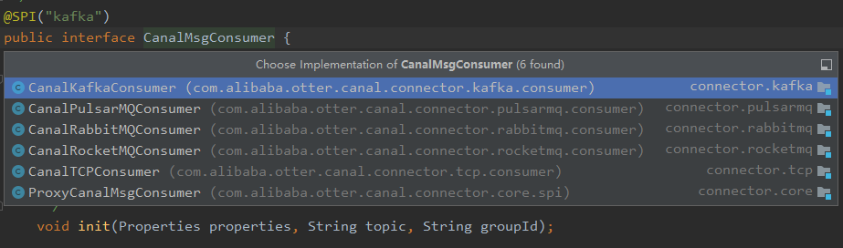

# Canal 

## Canal-adapter 

client-adapter分为适配器和启动器两部分, 适配器为多个fat jar, 每个适配器会将自己所需的依赖打成一个包, 以SPI的方式让启动器动态加载

启动器为 SpringBoot 项目, 支持canal-client启动的同时提供相关REST管理接口

### 1.目录介绍

```
- launcher
    - src.mian
        - assembly 项目打包配置
        - bin   项目启动脚本
        - java  源码
            - CanalAdaterApplication.java 启动器启动类
        - resources 配置文件
    - pom.xml 
```

### 2. 启动器启动流程

#### CanalAdapterService 适配器启动业务类
项目启动过程中，会初始化 `CanalAdapterService` （适配器启动业务类），简化代码如下：
```java
/**
 * 适配器启动业务类
 *
 * @author rewerma @ 2018-10-20
 * @version 1.0.0
 */
@Component
@RefreshScope
public class CanalAdapterService {
    属性列表 ...

    @PostConstruct
    public synchronized void init() {
        if (running) {
            return;
        }
        try {
            syncSwitch.refresh();
            logger.info("## syncSwitch refreshed.");
            logger.info("## start the canal client adapters.");
            adapterLoader = new CanalAdapterLoader(adapterCanalConfig);
            adapterLoader.init();
            running = true;
            logger.info("## the canal client adapters are running now ......");
        } catch (Exception e) {
            logger.error("## something goes wrong when starting up the canal client adapters:", e);
        }
    }

    @PreDestroy
    public synchronized void destroy() {
    }
}
```

init 方法标识有 `@PostConstruct` 注解，该方法会在 Spring 容器初始化 bean 之后被调用
其中 init 方法创建了 `CanalAdapterLoader` 对象，并调用了它的 init 方法。下面再看 `CanalAdapterLoader`类的实现。

#### CanalAdapterLoader 外部适配器的加载器
CanalAdapterLoader 类的简化代码：
```java
/**
 * 外部适配器的加载器
 *
 * @version 1.0.0
 */
public class CanalAdapterLoader {
    public CanalAdapterLoader(CanalClientConfig canalClientConfig){
        this.canalClientConfig = canalClientConfig;
    }

    /**
     * 初始化canal-client
     */
    public void init() {
        loader = ExtensionLoader.getExtensionLoader(OuterAdapter.class);

        for (CanalClientConfig.CanalAdapter canalAdapter : canalClientConfig.getCanalAdapters()) {
            for (CanalClientConfig.Group group : canalAdapter.getGroups()) {
                int autoGenId = 0;
                List<List<OuterAdapter>> canalOuterAdapterGroups = new CopyOnWriteArrayList<>();
                List<OuterAdapter> canalOuterAdapters = new CopyOnWriteArrayList<>();

                for (OuterAdapterConfig config : group.getOuterAdapters()) {
                    ...
                    loadAdapter(config, canalOuterAdapters);
                }
                ...
                AdapterProcessor adapterProcessor = canalAdapterProcessors.computeIfAbsent(
                        canalAdapter.getInstance() + "|" + StringUtils.trimToEmpty(group.getGroupId()),
                        f -> new AdapterProcessor(canalClientConfig,
                                canalAdapter.getInstance(),
                                group.getGroupId(),
                                canalOuterAdapterGroups));
                adapterProcessor.start();
                
            }
        }
    }

    private void loadAdapter(OuterAdapterConfig config, List<OuterAdapter> canalOutConnectors) {
        try {
            OuterAdapter adapter;
            
            adapter = new ProxyOuterAdapter(loader.getExtension(config.getName(), config.getKey()));

            Environment env = (Environment) SpringContext.getBean(Environment.class);
            Properties evnProperties = null;
            
            // 获取配置文件...
            
            adapter.init(config, evnProperties);
            ...
        } catch (Exception e) {
            logger.error("Load canal adapter: {} failed", config.getName(), e);
        }
    }
    
    
}
```
在 new CanalAdapterLoader(adapterCanalConfig) 中注入了 AdapterCanalConfig 对象，该类是canal 的相关配置类，application.yml中的适配器配置会注入到该类

当调用了 CanalAdapterLoader.init 方法后，首先双层for循环对 application.yml 中配置的 canalAdapters 适配器列表进行初始化，其中 `            adapter = new ProxyOuterAdapter(loader.getExtension(config.getName(), config.getKey()));
` 使用SPI方式 根据 name参数，进行实例化。

` OuterAdapter adapter` 该类是外部适配器接口，canal一共提供了12种外部适配器实现


12种实现类是对不同数据库的适配，例如：canal-adapter-kafka、canal-adapter-rdb、canal-adapter-mq等。
之后，对 **每组适配器（对应配置文件中的 Group）初始化一个 AdapterProcessor 对象**，该对象会启动一个线程，用于监听canal-client的binlog数据，并调用外部适配器进行数据同步。
下面看 AdapterProcessor 对象是如何进行数据同步的。

#### AdapterProcessor 适配器处理器

AdapterProcessor 的简化代码：
```java
public class AdapterProcessor {
    public AdapterProcessor(CanalClientConfig canalClientConfig, String destination, String groupId,
                            List<List<OuterAdapter>> canalOuterAdapters){
        ...
        // 通过SPI类加载器加载对应模式（mode 支持四种 tcp kafka rocketMQ rabbitMQ）下的消费端
        ExtensionLoader<CanalMsgConsumer> loader = new ExtensionLoader<>(CanalMsgConsumer.class);
        // see https://github.com/alibaba/canal/pull/5175
        String key = destination + "_" + groupId;
        canalMsgConsumer = new ProxyCanalMsgConsumer(loader.getExtension(canalClientConfig.getMode().toLowerCase(),
                key,
                CONNECTOR_SPI_DIR,
                CONNECTOR_STANDBY_SPI_DIR));

        Properties properties = canalClientConfig.getConsumerProperties();
        ...
        canalMsgConsumer.init(properties, canalDestination, groupId);
    }

    public void start() {
        if (!running) {
            thread = new Thread(this::process);
            thread.setUncaughtExceptionHandler(handler);
            thread.start();
            running = true;
        }
    }

    private void process() {
        
    }
}
```
##### 构造器中加载消费者端
AdapterProcessor 对象在被初始化过程中，会通过 SPI 加载对应的消费端CanalMsgConsumer canalMsgConsumer，该消费者实现提供了6种


##### AdapterProcessor.process方法
start 方法中，会启动一个线程，该线程会调用 process 方法，该方法会调用 canalMsgConsumer 的 process 方法
```java
private void process() {
    ...
    while (running) {
        try {
            syncSwitch.get(canalDestination);
            canalMsgConsumer.connect();
            ...
            while (running) {
                // 获取同步开关状态
                try {
                    syncSwitch.get(canalDestination, 1L, TimeUnit.MINUTES);
                } catch (TimeoutException e) {
                    break;
                }
     
                for (int i = 0; i < retry; i++) {
                    
                    try {
                        ...
                        long begin = System.currentTimeMillis();
                        List<CommonMessage> commonMessages = canalMsgConsumer
                            .getMessage(this.canalClientConfig.getTimeout(), TimeUnit.MILLISECONDS);
                        writeOut(commonMessages);
                        canalMsgConsumer.ack();
                        ...
                        break;
                    } catch (Exception e) {
                        if (i != retry - 1) {
                            canalMsgConsumer.rollback(); // 处理失败, 回滚数据
                        } else {
                            // 重试次数用完时
                            if (canalClientConfig.getTerminateOnException()) {
                                canalMsgConsumer.rollback();
                                syncSwitch.off(canalDestination);
                            } else {
                                canalMsgConsumer.ack();
                            }
                        }
                        Thread.sleep(500);
                    }
                }
            }

            canalMsgConsumer.disconnect();
        } catch (Throwable e) {
            logger.error("process error!", e);
        }

        if (running) { // is reconnect
            try {
                Thread.sleep(1000);
            } catch (InterruptedException e) {
                // ignore
            }
        }
    }
}
```
while 循环中，会调用canalMsgConsumer.getMessage方法，从阻塞队列中获取一个批量消息数据，之后调用writeOut(commonMessages)方法进行数据同步。
#### CanalRocketMQConsumer
CanalRocketMQConsumer 在初始化时，会创建一个阻塞队列，用于存放从消息队列中获取的消息。

connect 方法中，会创建一个 DefaultMQPushConsumer 对象，并注册一个消息监听器，该监听器每次收取批量消息组装成一个批量消息对象放入阻塞队列中

getMessage 方法用于，从阻塞队列中取出数据
```java
@SPI("rocketmq")
public class CanalRocketMQConsumer implements CanalMsgConsumer {
    private BlockingQueue<ConsumerBatchMessage<CommonMessage>> messageBlockingQueue;
    private DefaultMQPushConsumer                              rocketMQConsumer;
    
    @Override
    public void init(Properties properties, String topic, String groupName) {
        ...
        this.messageBlockingQueue = new LinkedBlockingQueue<>(1024);
        ...
    }

    @Override
    public void connect() {
        ...
        rocketMQConsumer = new DefaultMQPushConsumer(...);
        rocketMQConsumer.registerMessageListener((MessageListenerOrderly) (messageExts, context) -> {
            context.setAutoCommit(true);
            boolean isSuccess = process(messageExts);
            if (isSuccess) {
                return ConsumeOrderlyStatus.SUCCESS;
            } else {
                return ConsumeOrderlyStatus.SUSPEND_CURRENT_QUEUE_A_MOMENT;
            }
        });
        rocketMQConsumer.start();
        ...
    }
    
    private boolean process(List<MessageExt> messageExts) {
        if (logger.isDebugEnabled()) {
            logger.debug("Get Message: {}", messageExts);
        }
        List<CommonMessage> messageList = new ArrayList<>();
        for (MessageExt messageExt : messageExts) {
            byte[] data = messageExt.getBody();
            if (data != null) {
                try {
                    if (!flatMessage) {
                        Message message = CanalMessageSerializerUtil.deserializer(data);
                        messageList.addAll(MessageUtil.convert(message));
                    } else {
                        CommonMessage commonMessage = JSON.parseObject(data, CommonMessage.class);
                        messageList.add(commonMessage);
                    }
                } catch (Exception ex) {
                    logger.error("Add message error", ex);
                    throw new CanalClientException(ex);
                }
            } else {
                logger.warn("Received message data is null");
            }
        }
        ConsumerBatchMessage<CommonMessage> batchMessage = new ConsumerBatchMessage<>(messageList);
        try {
            messageBlockingQueue.put(batchMessage);
        } catch (InterruptedException e) {
            logger.error("Put message to queue error", e);
            throw new RuntimeException(e);
        }
        boolean isCompleted;
        try {
            isCompleted = batchMessage.waitFinish(batchProcessTimeout);
        } catch (InterruptedException e) {
            logger.error("Interrupted when waiting messages to be finished.", e);
            throw new RuntimeException(e);
        }
        boolean isSuccess = batchMessage.isSuccess();
        return isCompleted && isSuccess;
    }
}
```

##### AdapterProcessor.writeOut方法
canalMsgConsumer.getMessage 方法取出数据后，调用AdapterProcessor.writeOut方法进行数据的写入
该方法循环组间适配器，每个适配器都以线程池的方式运行。循环中调用各个适配器实现的sync
方法，进行数据同步。
```java
public void writeOut(final List<CommonMessage> commonMessages) {
        List<Future<Boolean>> futures = new ArrayList<>();
        // 组间适配器并行运行
        // 当 canalOuterAdapters 初始化失败时，消息将会全部丢失
        canalOuterAdapters.forEach(outerAdapters -> {
            futures.add(groupInnerExecutorService.submit(() -> {
                try {
                    // 组内适配器穿行运行，尽量不要配置组内适配器
                    outerAdapters.forEach(adapter -> {
                        long begin = System.currentTimeMillis();
                        List<Dml> dmls = MessageUtil.flatMessage2Dml(canalDestination, groupId, commonMessages);
                        batchSync(dmls, adapter);

                        if (logger.isDebugEnabled()) {
                            logger.debug("{} elapsed time: {}",
                                adapter.getClass().getName(),
                                (System.currentTimeMillis() - begin));
                        }
                    });
                    return true;
                } catch (Exception e) {
                    logger.error(e.getMessage(), e);
                    return false;
                }
            }));

            // 等待所有适配器写入完成
            // 由于是组间并发操作，所以将阻塞直到耗时最久的工作组操作完成
            RuntimeException exception = null;
            for (Future<Boolean> future : futures) {
                try {
                    if (!future.get()) {
                        exception = new RuntimeException("Outer adapter sync failed! ");
                    }
                } catch (Exception e) {
                    exception = new RuntimeException(e);
                }
            }
            if (exception != null) {
                throw exception;
            }
        });
    }

```

## 总结
Cliect-Adapter项目
1. 项目的启动器，将配置的每一组各类型的（RDB、ES...）适配器进行初始化。
2. 每一组适配器启动一个消费线程（类型 #tcp kafka rocketMQ rabbitMQ），一组对应一个topic，mq线程订阅topic，批量消费数据，将消费的数据写入到MQ消费者本地缓存阻塞队列中。
3. 同一组适配器并行运行，从阻塞队列中取出数据，进行数据同步。